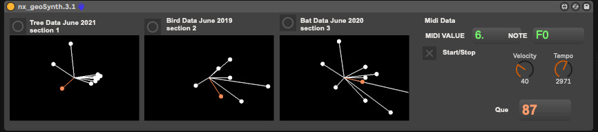

# geosynth

## MaxforLive device that uses Location data to drive midi signals

Download and place in your /maxforlive folder. Currently working with local geo points. Can link to other data sources in next versions.

